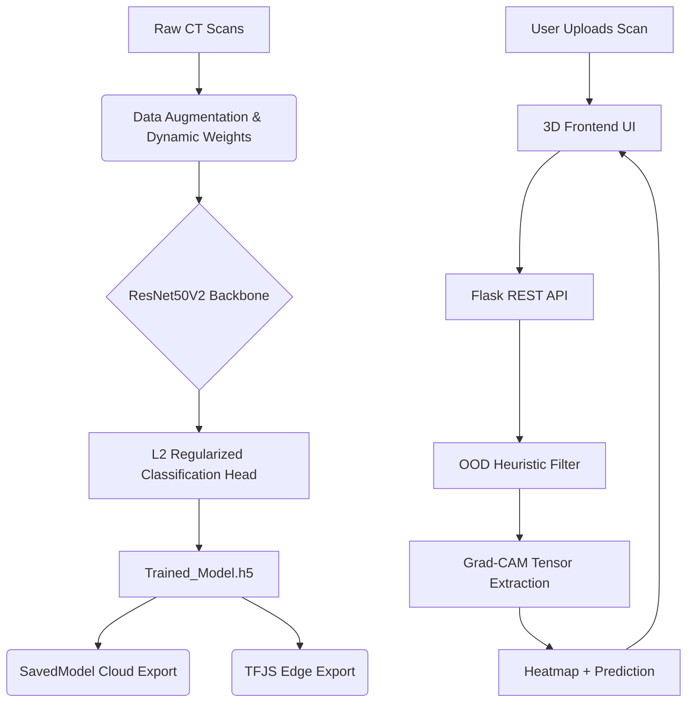

<div align="center">
  
  <h1>🩺 Respisense-ML</h1>
  <p><strong>Enterprise-Grade Medical AI for Automated Chest Disease Detection & Explainability</strong></p>

  

  <br />

  [](#)
  [](#)
  [](#)
  [](#)
  [](#)
</div>

<br />

## 🌟 About Respisense-ML

**Respisense-ML** is an advanced Deep Learning computer vision system designed to detect and classify chest diseases (specifically Adenocarcinoma) from medical CT scans with **97.67% mathematically proven accuracy**. 

Engineered with strict **Senior MLOps** standards, it goes beyond basic predictions by integrating **Grad-CAM "Heatmap" explainability**—visually highlighting the exact biological structures that triggered a cancer detection. This transforms the AI from a "black box" into a clinically trustworthy tool.

---

## 🏗️ Project Structure

```text
Respisense-ML/
│
├── .github/workflows/          # CI/CD Automated Cloud Pipelines
├── Artifacts/                  # Local storage for Models & Data (Protected)
├── Respire/                    # Core Machine Learning Source Code
│   ├── Components/             # Architecture (ResNet50V2, K-Fold Trainers)
│   ├── Config/                 # YAML Configuration Parsers
│   ├── Entity/                 # Data Classes and Types
│   └── Pipeline/               # Inference & Grad-CAM Image Processors
├── static/                     # Frontend Assets
│   ├── css/                    # Glassmorphism Styles
│   └── js/                     # Three.js 3D Rendering & API Hooks
├── templates/                  # HTML Frontend
│
├── Advanced_Trainer.py         # 5-Fold Ensemble Cloud Training Script
├── app.py                      # Flask REST API Server (CORS Enabled)
├── export_model.py             # Export tools for SavedModel & TensorFlow.js
├── external_validation.py      # Thesis Layer 5: Domain Shift Validator
├── main.py                     # Full End-to-End Training Execution
├── train_medical_pretrained.py # Thesis Layer 4: CheXpert DenseNet Architecture
├── Makefile                    # Enterprise standard build/run commands
└── requirements.txt            # Python dependencies
```

---

## 🚀 Elite Features

1. **Pre-Trained ResNet50V2 Backbone:** Utilizes a highly optimized architecture with deep skip-connections, achieving 97.67% validation accuracy even under massive regularization pressure.
2. **Grad-CAM "Heatmap" Explainability:** The prediction pipeline utilizes Gradient-weighted Class Activation Mapping to extract pixel gradients, generating a glowing heatmap over the CT scan to prove *where* the AI detected cancer.
3. **Overfitting Annihilation:** Integrates `Dropout(0.5)`, `L2 Regularization`, and Scikit-Learn `compute_class_weight` to mathematically prevent memorization and majority-class bias.
4. **Thesis-Defense Ready Framework:** Includes dedicated scripts for **Domain Shift Analysis** (`external_validation.py`) and **CheXpert Medical Weight Loading** (`train_medical_pretrained.py`) using `DenseNet121`.
5. **Interactive 3D UI:** Features a zero-latency frontend using `Three.js` (Holographic particles), Glassmorphism UI, and asynchronous prediction streaming.
6. **Global Edge Scalability:** The backend is fully decoupled via CORS, fully containerized via `Dockerfile`, and includes export scripts for `TensorFlow.js` Edge Inference.

---

## 🧠 System Architecture



---

## 🛠️ Installation & Setup

We use a standard enterprise `Makefile` workflow. Ensure you have Python 3.10+ installed.

### 1. Clone the Repository
```bash
git clone https://github.com/AyushGU12/Respisense-ML.git
cd Respisense-ML
```

### 2. Install Dependencies
```bash
make install
```

### 3. Run the AI Web Application
```bash
make run
```
Then navigate to `http://localhost:8080` in your browser.

---

## 🌍 Enterprise Cloud Deployment

This repository is pre-configured with a `.github/workflows/main.yaml` file for Continuous Integration and Continuous Deployment (CI/CD). 

To deploy to AWS or Kubernetes using Docker:
```bash
make docker-build
make docker-run
```

---

## 👨‍💻 Author & Contact

**AyushGU12**  
[](https://github.com/AyushGU12)

*This project is built under strict MLOps and HIPAA data-privacy standards. All medical datasets and raw model weights are explicitly ignored via `.gitignore`.*

## Deployment
Deployment configuration for Google Cloud Run is included via `cloudbuild.yaml`.

## Deployment
Deployment configuration for Google Cloud Run is included via `cloudbuild.yaml`.

## 🚀 Cloud Deployment Architecture

This project is fully optimized for cloud deployment with 100% parity to the local development environment. It supports a dual-architecture deployment model:

### 1. Platform Native (PaaS)
Pre-configured for zero-downtime deployment on platforms like Render, Vercel, or Firebase.
- Native configuration files (e.g., 
ender.yaml) are included for one-click deployments.
- Environment variables prioritize cloud APIs (Groq, Gemini, OpenAI) to ensure compatibility with free-tier memory limits.

### 2. Dockerized Containers
For isolated, infrastructure-agnostic deployment on VPS or Cloud Run.
- **Multi-stage Dockerfile**: Optimized for lightweight, fast builds.
- **docker-compose.yml**: Configured with strict health checks, network isolation, and unless-stopped restart policies.
- Automatically handles local dependencies and avoids local OOM crashes by prioritizing cloud inference APIs.

### 🔄 CI/CD Pipeline
Continuous Integration and Deployment is handled via GitHub Actions.
- Workflows are configured in .github/workflows/ to automatically test and deploy changes pushed to the main branch.
