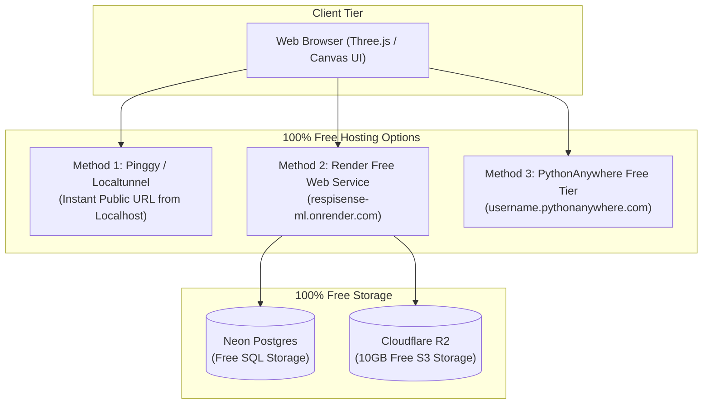
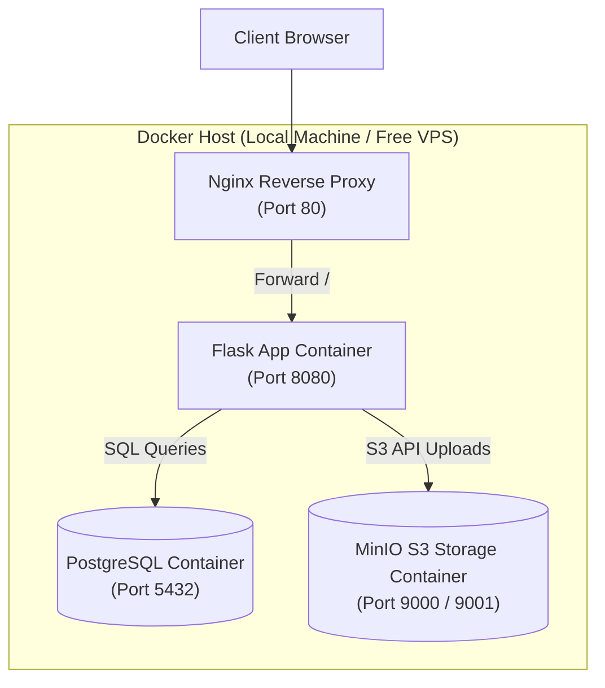

# Respisense-ML Architecture Documentation

Respisense-ML supports a **Dual Architecture Model** built strictly using **100% Free Forever** tools (no credit card required):

---

## Model 1: Cloud-Native & Free Presentation Architecture

Used for live presentation demos, interviews, and public portfolio showcases.

---

## Model 2: Self-Hosted Docker Compose Architecture

Used for local development or self-hosting on any hardware/VPS.

---

## Platform Comparison (100% Free Tier)

| Option | URL Type | Credit Card Required? | Best For |
|---|---|---|---|
| **Pinggy / Localtunnel** | Temporary Public HTTPS Link | **No** | **Live Interview Presentations** (Runs on localhost hardware with 0 limits) |
| **Render Web Service** | Permanent (`.onrender.com`) | **No** | Permanent Portfolio Link |
| **PythonAnywhere** | Permanent (`.pythonanywhere.com`) | **No** | Lightweight Flask Hosting |
| **Neon Postgres** | Database Connection String | **No** | Free PostgreSQL Database |
